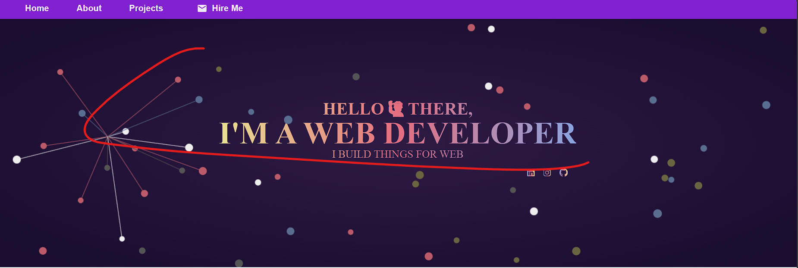

# 🌐 Fullstack Portfolio Website

This is my personal developer portfolio built using:

- ⚛️ **React** (Frontend)
- 🌐 **Express.js** + **Node.js** (Backend)
- 🍃 **MongoDB Atlas** (Database)
- 🚀 Hosted on **Vercel** (Frontend) & **Render** (Backend)

## 🔗 Live Links

- **Portfolio**: [your-frontend-url.vercel.app](https://portfolio-five-ecru-50.vercel.app/)
- **API**: [your-backend-url.onrender.com](https://portfolio-54uy.onrender.com)

## 📬 Features

- Contact form with live backend storage
- Responsive, mobile-first design
- Environment variables via `.env`
- MongoDB for persistent message storage

## ⚙️ Setup Instructions


### Frontend
```bash
cd frontend
npm install
#Update .env with your Links
npm run dev
```
### Backend
```bash
cd backend
npm install
# Update .env with MONGO_URI and PORT
node server.js
```


